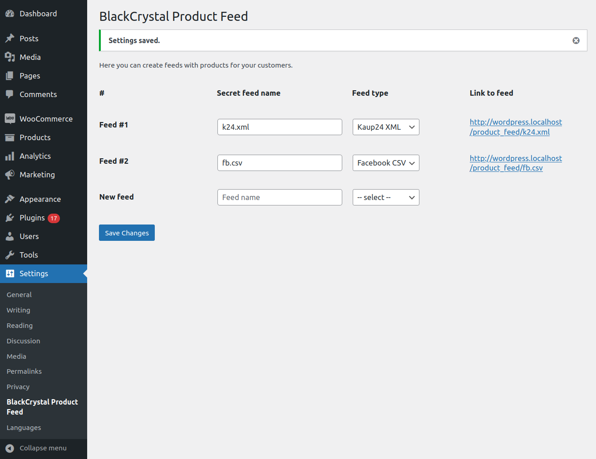
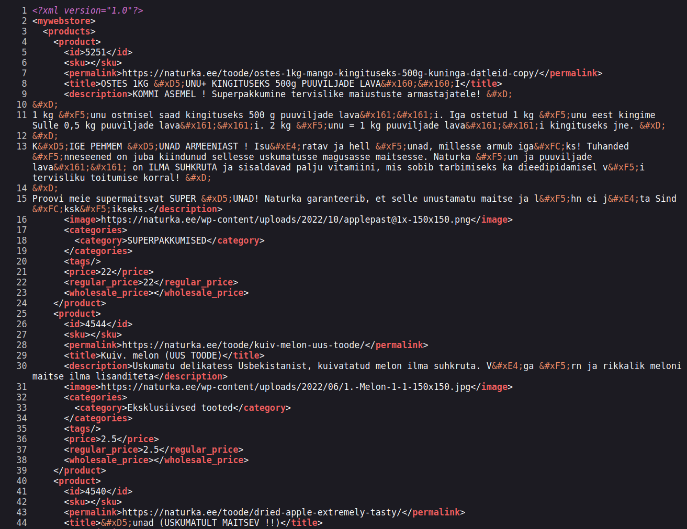

# BlackCrystal Product Feed

- Contributors: [miamibc](https://github.com/miamibc)
- Donate link: http://www.blackcrystal.net/project/woocommerce-product-xml/
- Tags: woocommerce, products, xml
- Requires at least: 4.0
- Requires PHP: 7.0
- Tested up to: 6.1.1
- Stable tag: 6.1.1
- License: [GPLv2](http://www.gnu.org/licenses/gpl-2.0.html)

Plugin adds XML feed with products to your webshop (Woocommerce)

## Description

Plugin adds Facebook CSV and Kaup24 XML feeds with products to your webshop (Woocommerce) with title, description,
image, categories, tags, regular/sale/wholesale prices. 

## Features
  
* Plugin is free and always will be, [donations](https://www.paypal.com/cgi-bin/webscr?cmd=_s-xclick&hosted_button_id=8Y8DAJ3BVD6DU) very welcome.
* No advertises, clean and handy.
* Easy interface to manage feeds. You can have any number of feeds.
* No special requirements, working Wordpress with Woocommerce

## More

* We made it, because all similar plugins are slow and buggy;
* We made it, because it's simple and we can do it;
* We made it, to learn something new - yeah, wordpress always makes me to learn something new;
* «Show what you can. Learn what you don’t.» — [BlackCrystal](https://www.blackcrystal.net/), 1999.

## Installation

1. Upload the plugin files to the `/wp-content/plugins/blackcrystal-product-feed` directory, or install the plugin through the WordPress plugins screen directly.
2. Activate the plugin through the 'Plugins' screen in WordPress
3. Use the **Settings** -> **BlackCrystal Product Feed** screen to configure the plugin
4. Type feed **name** select **type**, click **Save**
5. Send link of new feed to your partner

## Frequently Asked Questions

### I don't see link to feed

Both `name` and `type` boxes must be filled.

### I don't see some products in feed

Maybe product was not `published`, not `in stock` or not `visible`? Anyways, it's better to let us know about this, please contact.

### How to remove feed

Clear `name` and `type` boxes of feed you want to remove and click Save.

## Screenshots

## Upgrade Notice

Just upgrade

## Changelog

### 1.0

Initial version with Facebook CSV and Kaup24 XML feeds

